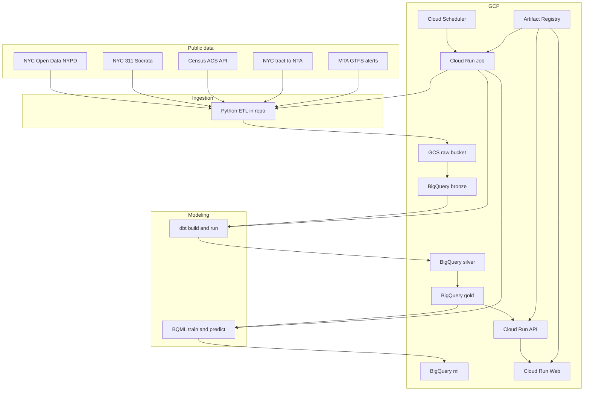

# NYC Roulette

NYC Roulette is a crime intelligence and urban analytics platform built on public NYC data. It combines NYPD complaint records, Census ACS demographics, NYC geography mappings, 311 street signals, MTA service alerts, and the original 311 tenant-alert backbone into an end-to-end data product: **extract → lake → warehouse → models → API → web**.

The product surfaces an interactive crime analytics experience—charts, maps, avoidability views, and demographic context—backed by a **medallion-style BigQuery** warehouse and **BigQuery ML** for risk scoring.

## Data engineering & data science highlights

- **Medallion warehouse on BigQuery:** `bronze` (raw loads), `silver` (cleaned, conformed events), `gold` (facts, aggregates, demographics marts), `ml` (features, models, predictions). Terraform provisions datasets and IAM-aligned service accounts.
- **NYPD crime ETL:** Python pulls NYC Open Data historic (`qgea-i56i`) and YTD (`5uac-w243`) complaints via Socrata; normalized parquet can land locally, in **GCS**, and append/replace windows in **BigQuery bronze** before dbt takes over.
- **dbt as the transformation layer:** Builds `silver_crime_events`, `gold_fct_crime_events`, borough/day/hour aggregates, offense rollups, and **`gold_agg_demographics_by_nta`** (tract → NTA rollups joined to crime). Also **311 street-signal** silver models and **gold avoidability** outputs for the “I Would Avoid” experience.
- **Scheduled production refresh:** A **Cloud Run Job** runs daily (triggered by **Cloud Scheduler**): NYPD YTD ingest, rolling **311** partitions for late-arriving street signals, **MTA** service-alerts ingest, then **dbt build/run** for crime + avoidability graphs, **BQML** `train_crime_risk_rf_model`, **feature importance**, and **`predictions_crime_risk_latest`** refresh.
- **BigQuery ML (crime risk):** Hourly feature table → **random forest regressor** trained in BigQuery → predictions and explainability-style feature importance exposed downstream (see `docs/deployment.md` §6 for local backfill patterns).
- **Legacy / parallel analytics:** 311 complaint marts (`gold_fct_complaints`, etc.) and resolution-time ML scaffolding (`ml.features_resolution_time`, `ml.predictions_resolution_time`) remain available for tenant-focused workflows.
- **Quality & observability hooks:** Socrata app token and Census API key wired for ingestion; optional Soda/Dagster paths documented in-repo for deeper pipeline ops.

## Systems used

| Layer | Technology |
| --- | --- |
| **Cloud** | Google Cloud Platform |
| **IaC** | Terraform (`infra/`) — APIs, buckets, Artifact Registry, BigQuery datasets, Cloud Run (API + web), Cloud Run Job, Scheduler, IAM |
| **Raw storage** | GCS buckets (raw + artifacts) |
| **Warehouse** | BigQuery (US), datasets: `bronze`, `silver`, `gold`, `ml` |
| **Transform** | dbt (BigQuery adapter), models under `dbt/` |
| **Orchestration (prod)** | Cloud Scheduler → Cloud Run Job (`scripts/daily_crime_refresh.py`) |
| **Orchestration (optional)** | Dagster (`dagster_project/`) for local/partitioned asset graphs |
| **Serving** | FastAPI (`api/`) on Cloud Run; BigQuery client for analytics routes |
| **Frontend** | Next.js App Router (`web/`), Recharts, Plotly, Google Maps JS API, deck.gl |
| **Containers** | Docker — `Dockerfile.api`, `Dockerfile.worker`, `web/Dockerfile`; images in **Artifact Registry** |
| **Secrets / config** | Env vars + Terraform-injected service config; see `docs/secrets.md` |

## Architecture (GCP & data flow)

High-level flow: **public datasets → ingestion (Python) → GCS + BigQuery bronze → dbt (silver/gold/ml) → FastAPI → Next.js**. Production runs the same path inside the **worker** container on a schedule; the **API** and **web** services are stateless and read BigQuery (and cache where applicable).



Deploying or updating services: build and push **three** images (API, worker, web), then `terraform apply` with `api_image`, `worker_image`, and `web_image` (see **`docs/deployment.md`**).

## Product / feature highlights

- **Crime map:** Google Maps, optional Map ID, deck.gl layers, incident detail, Street View and NYC Open Data links.
- **Graphs:** Borough leaderboard, daily trend, severity mix, weekday/hour density, socioeconomic lens (including scatter and magazine layout), filing-mix **pie** view, and related metric cards.
- **Avoidability / street signals:** 311-derived signals and rankings (see gold avoidability models and dedicated web routes).
- **Demographic context:** Borough-level poverty, renter share, education, income, rent, and crime rate per 100k from `gold_agg_demographics_by_nta`.
- **Source traceability:** Popups and copy tie visuals back to NYPD and city open data.

## Repository layout

- `infra/` — Terraform for GCP foundations and Cloud Run.
- `ingestion/` — Source extract, normalization, GCS/BQ load helpers.
- `dagster_project/` — Dagster assets, jobs, schedules (optional local/CI orchestration).
- `dbt/` — Warehouse transformations, BQML model definitions, feature tables.
- `api/` — FastAPI application and BigQuery-backed routes.
- `web/` — Next.js frontend.
- `scripts/` — Production worker entrypoints (e.g. daily refresh).
- `ml/` — Supplemental BigQuery ML SQL where not fully captured in dbt.
- `docs/` — Data sources, secrets, table inventory, deployment runbook, methodology.

## Current data sources

- **NYPD complaints:** historic `qgea-i56i`, YTD `5uac-w243`.
- **NYC 311 complaints:** tenant/housing analytics, street-signal / avoidability paths.
- **Census ACS 5-year:** tract-level income, rent, poverty, race/ethnicity, tenure, education.
- **NYC tract-to-NTA equivalency:** bridge from tracts to neighborhood tabulation areas.
- **MTA:** service alerts feed used in the scheduled worker pipeline.

## Key BigQuery tables

- `bronze.raw_nypd_complaints`, `silver.silver_crime_events`, `gold.gold_fct_crime_events`
- `gold.agg_crime_by_borough_day`, `gold.agg_crime_by_hour`, `gold.agg_crime_offense_rankings`
- `gold.gold_agg_demographics_by_nta`
- `bronze.raw_311_complaints`, `silver.silver_complaints`, `gold.gold_fct_complaints`
- `ml` — crime risk features, model, predictions; resolution-time feature/prediction tables for legacy flows

See **`docs/bigquery_tables.md`** for the full inventory and starter SQL.

## Local setup

1. Create a virtual environment:
   - Windows PowerShell: `python -m venv .venv`
2. Activate:
   - `.venv\\Scripts\\Activate.ps1`
3. Install dependencies:
   - `python -m pip install --upgrade pip`
   - `pip install -r requirements/dev.txt`
   - `pip install -e .`
4. Copy environment template:
   - `copy .env.example .env`
5. Install web dependencies:
   - `cd web`
   - `npm install`

## Development checks

- `ruff check src tests ingestion api dagster_project`
- `mypy src`
- `pytest`
- `cd web && npx tsc --noEmit`
- `cd web && npm run build`

## Run local services

- `docker compose up`

## Deploy to GCP

Use **`docs/deployment.md`** for the full runbook. Summary:

- **Cloud Run** services for FastAPI and Next.js.
- **Cloud Run Job** for daily NYPD ingest, 311 partitions, MTA ingest, dbt builds, BQML retrain, predictions, and avoidability-related models.
- **Cloud Scheduler** triggers the job (default: morning America/New_York).
- **Artifact Registry** stores API, worker, and web container images (push all three, then `terraform apply` with image variables set).

## Run API locally

- `uvicorn api.app.main:app --reload --port 8000`

## Run web locally

Start the API first (see above), then:

```powershell
cd web
npm install
npm run dev
```

The frontend calls FastAPI via `NEXT_PUBLIC_API_URL` (default `http://localhost:8000`). If you see connection errors, confirm the API is listening on the same host/port.

Routes (among others):

- `/graphs` — crime charts and socioeconomic visuals.
- `/map` — Google Maps / deck.gl crime map.
- `/avoid` — avoidability / street-signal rankings.
- `/` — redirects to `/graphs`.

For the map, enable **Maps JavaScript API**, create a browser-restricted key, and set in `.env`:

```env
NEXT_PUBLIC_GOOGLE_MAPS_API_KEY=your-browser-restricted-google-maps-api-key
NEXT_PUBLIC_GOOGLE_MAP_ID=your-optional-google-vector-map-id
```

Restrict the key to your local and deployed web origins. `web/next.config.js` loads `NEXT_PUBLIC_*` from the repo-root `.env`.

## Ingest NYPD crime data

Historic NYPD complaints use `qgea-i56i`; current YTD uses `5uac-w243`.

Small smoke test without touching GCP:

```powershell
python -m ingestion.crime.cli --source historic --start-date 2024-01-01 --end-date 2024-01-02 --max-pages 1
```

Load a date window to GCS and BigQuery:

```powershell
python -m ingestion.crime.cli --source historic --start-date 2024-01-01 --end-date 2024-02-01 --upload-to-gcs --load-to-bigquery
```

Then rebuild dbt (set `GCP_PROJECT_ID` to your project):

```powershell
$env:GCP_PROJECT_ID = 'YOUR_GCP_PROJECT_ID'
dbt build --project-dir D:\Tenant-Alert\dbt --profiles-dir D:\Tenant-Alert\dbt --select silver_crime_events+
```

## Ingest demographics and geography features

Add your Census API key to `.env`:

```env
CENSUS_API_KEY=your-census-api-key
```

Ingest ACS tract demographics for an ACS 5-year vintage:

```powershell
python -m ingestion.census.cli --year 2023 --upload-to-gcs --load-to-bigquery
```

Ingest NYC tract-to-NTA equivalency:

```powershell
python -m ingestion.geography.cli --dataset tract-nta --upload-to-gcs --load-to-bigquery
```

Then rebuild dbt:

```powershell
$env:GCP_PROJECT_ID = 'YOUR_GCP_PROJECT_ID'
dbt build --project-dir D:\Tenant-Alert\dbt --profiles-dir D:\Tenant-Alert\dbt --select silver_census_acs_tract+ silver_tract_nta_equivalency+
```

The dashboard/API can then read `gold.gold_agg_demographics_by_nta` for socioeconomic context.

## Legacy 311 Tenant Pipeline

This writes parquet under `data/raw/nyc311/...` and does not touch GCP:

- `python -m ingestion.nyc311.cli --date 2024-01-01 --max-pages 1`

After GCP resources exist and auth is configured, upload and load bronze:

- `python -m ingestion.nyc311.cli --date 2024-01-01 --upload-to-gcs --load-to-bigquery`

Backfill a date range (loads one day at a time; consider `--sleep-seconds` for throttling):

- `python -m ingestion.nyc311.cli --start-date 2024-01-01 --end-date 2024-01-31 --upload-to-gcs --load-to-bigquery`

Re-running a day replaces that day in BigQuery bronze via a `DELETE` for that `created_date` day before append-loading the new parquet.

## Run dbt (silver/gold marts)

After bronze has data:

```powershell
cd dbt
dbt build
```

See **`dbt/README.md`**. FastAPI can serve 311 gold marts when available (`ANALYTICS_USE_GOLD=true` in deployed env).

For Dagster, open the UI and materialize assets as needed. Local runs often use `ETL_UPLOAD_TO_GCS=false` and `ETL_LOAD_TO_BIGQUERY=false` unless you opt into GCP in `.env`.

## Security Notes

- Keep `.env`, `.conf`, and Google service-account files out of git.
- Use browser restrictions on `NEXT_PUBLIC_GOOGLE_MAPS_API_KEY`.
- Restrict the Maps key to the Maps JavaScript API.
- Use `scripts/check_secrets.py` before committing sensitive changes.

## Product Roadmap

- Add borough/NTA boundary polygons and normalized per-capita choropleths.
- Add filterable time windows and offense-family controls.
- Add narrative "borough tour" camera sequences for demos.
- Improve BQML risk score calibration and add offline model evaluation panels.
- Add custom domain, CDN, and production monitoring dashboards.
